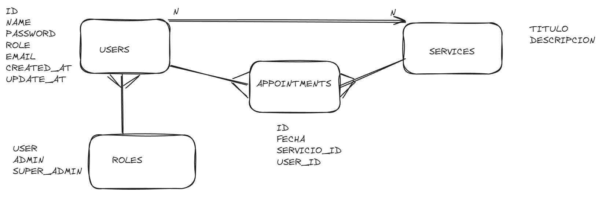
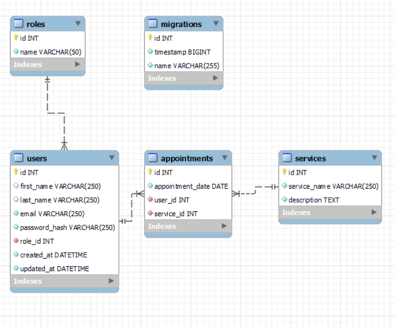

# Tattoo Studio Project

Welcome to my first backend project!


<br>

<details>
  <summary> Contents 📝</summary>
  <ol>
    <li><a href="#about-the-project">About the project</a></li>
    <li><a href="#stack">Stack</a></li>
    <li><a href="#local-installation">Installation</a></li>
    <li><a href="#initial approach">Initial Approach</a></li>
    <li><a href="#database Diagram">Database Diagram</a></li>
    <li><a href="#db-relations">Database Relations</a></li>
    <li><a href="#endpoints">Endpoints</a></li>
    <li><a href="#problems-solutions">Problems Solutions</a></li>
    <li><a href="#future-functionalities">Future Functionalities</a></li>
    <li><a href="#acknowledgements">Acknowledgements</a></li>
    <li><a href="#development">Development</a></li>
    <li><a href="#contact">Contact</a></li>
  </ol>
</details>

## About the project :bricks:
In this first backend project, the product department asked us to develop the backend for the appointment management system for a tattoo studio.
<br>
<br>
Users must register in the application, log in and access their personal area.
area. Within their area, they will be able to see a list of scheduled appointments for tattoo and piercing tattoo and piercing services,
as well as create new appointments for various services offered by the services offered by the studio, such as:
<br>
<br>

<b>1. Personalised tattoos:</b>
Description: Customers will have the freedom to select unique motifs and designs, fully customising their tattoo experience according to their preferences and tastes.
<br>

<b>2. Catalogue tattoos:</b>
Description: We offer tattooing based on predefined designs from our catalogue. Customers can choose from a variety of stylish and proven options.
<br>

<b>3. Restoration and rejuvenation work:</b>
Description: We specialise in the restoration and rejuvenation of existing tattoos. Our experts work to enhance and renew old tattoos, giving them back their vitality.
<br>

<b>4. Placement of piercings and dilators:</b>
Description: We offer professional services for the placement of piercings and dilators. Our team ensures safe procedures and varied styles to meet the individual preferences of our clients.
<br>

<b>5. Sale of piercings and other items:</b>
Description: In addition to our application services, we offer a selection of piercings and other body art related items. Customers can purchase quality products to complement their unique style.
<br>

In addition, there will be a user section where they will be able to access their personal data, viewable only by the user (profile).
<br>


## Stack :rocket:
<div align="center">
<a href="">
    
</a>
<a href="https://www.expressjs.com/">
    
</a>
<a href="">
    
</a>
<a href="https://nodejs.org/es/">
    
</a>
<a href="https://developer.mozilla.org/es/docs/Web/JavaScript">
    
</a>
<a href="">

</a>
<a href="">
    
</a>
<a href="">
    
</a>
<a href="">
    
</a>
 </div>

 ## Installation :computer:

1. If you don't have MySQL installed on you computer, you can install Docker and execute the above command on your Powershell to create a MySQL container
` $ docker run --name nombre-contenedor -p 3311:3306 -e MYSQL_ROOT_PASSWORD=1234 -d mysql `
2. Clone the repository
` $ git clone https://github.com/SantiagoAlfaroMarti/Tattoo-Studio.git `
3. Install dependencies
` $ npm install `
4. Run server
` $ npm run dev `
5. Run migrations on DB
` $ npm run run-migrations `
6. Mock DB with seeders
` $ npm run seeds `

## Initial Approach :spiral_notepad:


## Database Diagram :chart_with_upwards_trend:


## Database Relations :clipboard:
    
    - "Roles" to "Users": One-to-many relationship
    where:
      - One role can have many users.

    - "Users" to "Appointments": One-to-many relationship
    where:
      - One user can have many appointments.

    - "Services" to "Appointments": One-to-many relationship
    where:
      - One service can have many appointments.


## Endpoints :jigsaw:

<details>
<summary>Authentication</summary>

- AUTH

  - REGISTER

          POST http://localhost:4000/api/auth/register

    body:

    ```js
        {
            "email": "mail@mail.com",
            "password": "123456789"
        }
    ```

  - LOGIN

          POST http://localhost:4000/api/auth/login

    body:

    ```js
        {
            "email": "mail@mail.com",
            "password": "123456789"
        }
    ```

      </details>
      <details>

<summary>Users</summary>

- USERS

      - GET ALL USERS (ONLY FOR ADMINS)

              GET http://localhost:4000/api/users

          auth:
          ```
          your token

          ```

       - SHOW USER PROFILE

              GET http://localhost:4000/api/users/profile

          auth:
          ```
          your token

          ```

      - CHANGE PROFILE INFO

              PUT http://localhost:4000/api/users/profile/change

          auth:
          ```
          your token

          ```
          body:
          ``` js
              {
                  change of information here
              }
          ```

      - PROFILE FILTERED BY EMAIL

              GET http://localhost:4000/api/users/:email

          auth:
          ```
          your token
          ```
          body:
          ``` js
               {
                  "email": "email users"
               }
          ```

      - DELETE USER BY ID

              GET http://localhost:4000/api/users/:id

          auth:
          ```
          your token
          ```
          body:
          ``` js
               {
                  "id": "delete user id"
               }
          ```

</details>

<details>

<summary>Appointments</summary>

- APPOINTMENTS

      - CREATE APPOINTMENT

              POST http://localhost:4000/api/appointments/create

          auth:
          ```
          your token
          ```
          body:
          ``` js
              {
                  "appointment_date": "2024/01/01",
                  "service_id": 2
              }
          ```

      - CHANGE APPOINTMENT

              PUT http://localhost:4000/api/appointments/change

          auth:
          ```
          your token
          ```
          body:
          ``` js
              {
                  "id": your appointment id,
                  "infotochange": value
              }
          ```

          - FIND APPOINTMENT BY ID

              GET http://localhost:4000/api/appointments/:id

          auth:
          ```
          your token
          ```
          body:
          ``` js
              {
                  "id": 1
              }
          ```

          - SHOW USER APPOINTMENTS

              GET http://localhost:4000/api/appointments/scheduled

          auth:
          ```
          your token
          ```

          - DELETE APPOINTMENT

              DELETE http://localhost:4000/api/appointments/delete

          auth:
          ```
          your token
          ```
          body:
          ``` js
              {
                  "id": 1
              }
          ```

  </details>

<details>

<summary> Services </summary>

- SERVICES 

    - CREATE SERVICE (admins)
        POST http://localhost:4000/api/services

          auth:
          ```
          your token
          ```
          body:
          ``` js
              {
                  "service_name": "Name",
                  "description": "description"
              }
          ```

      - SEE ALL SERVICES

              GET http://localhost:4000/api/services

          auth:
          ```
          your token
          ```


      - UPDATE SERVICE (admins)

              PUT http://localhost:4000/api/services/:id

          auth:
          ```
          your token
          ```
          body:
          ``` js
              {
                  "id": 2,
                  "description": "description"
              }
          ```
       - DELETE SERVICE BY ID

              GET http://localhost:4000/api/services/:id

          auth:
          ```
          your token
          ```
          body:
          ``` js
              {
                  "id": 1
              }
          ```

  </details>


<details>

<summary> Roles </summary>

- ROLES 

    - SEE ALL ROLES (admins)

              GET http://localhost:4000/api/roles

          auth:
          ```
          your token
          ```

    - CREATE ROLE (admins)
        POST http://localhost:4000/api/roles/create

          auth:
          ```
          your token
          ```
          body:
          ``` js
              {
                  "id": 1,
                  "name": "name"
              }
          ```

      - UPDATE ROLE (admins)

              PUT http://localhost:4000/api/roles/update/:id

          auth:
          ```
          your token
          ```
          body:
          ``` js
              {
                  "id": 2,
                  "infotoupdate": "update role"
              }
          ```
       - DELETE ROLE

              DELETE http://localhost:4000/api/roles/delete

          auth:
          ```
          your token
          ```
          body:
          ``` js
              {
                  "name": superAdmin
              }
          ```

  </details>

## Problems Solutions :boxing_glove:
The greatest difficulty I have encountered has been in establishing the relationships between users, artists, appointments, roles and services. Depending on each of them, they have different unions, depending on the type of union they are linked to.
But thinking first of all about how the relationships will be, I have been able to create all the links between each one of them.

## Future Functionalities :crystal_ball:
Tattoo and piercing artists will be able to choose and update their appointments.
<br>
Include reviews of tattoo artists and piercing artists, based on customer experience.
<br>
Include the frontend part so that customers can navigate with the API, and can select the desired service.
<br>
Differentiate tattoo artists from piercing artists.
<br>

## Acknowledgements :trophy:
I would like to thank the teachers of GeeksHub Academy for their dedication and commitment to develop this first backend project.
Repeating countless times the concepts to be able to assimilate them, explaining in different ways for its understanding and looking for solutions to all the errors that appeared in the terminal.

## Development :joystick:

``` js
 const developer = "santiagoalfaro";

 console.log("Developed by: " + developer);
```  


## Contact :calling:
<div align="center">
<a href = "mailto:santiagoalfamar@gmail.com"></a>
<a href="https://https://github.com/SantiagoAlfaroMarti"></a>
</div>